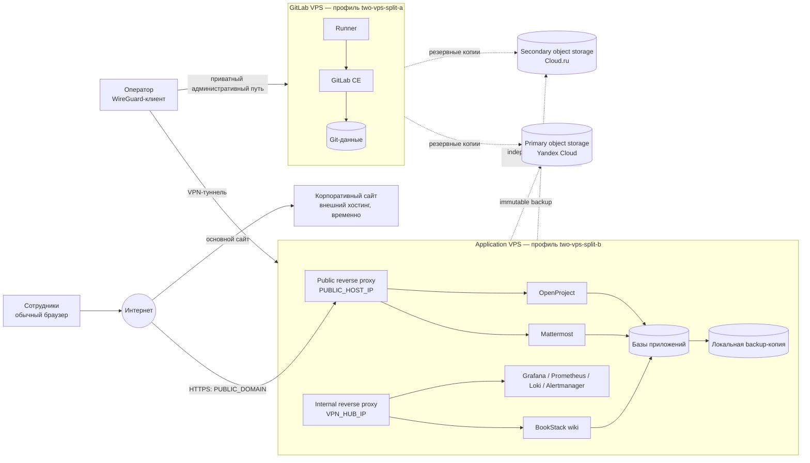
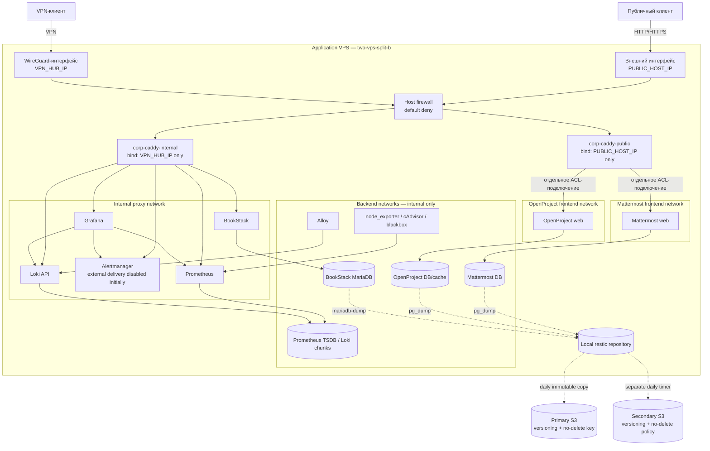

# Шаблоны схем архитектуры

Это обезличенное представление целевой архитектуры. Оно описывает роли,
границы доверия и сетевые пути, но намеренно не содержит реальных доменов,
IP-адресов, имён пользователей, провайдеров или секретов.

Обозначения вроде `PUBLIC_DOMAIN`, `PUBLIC_HOST_IP` и `VPN_HUB_IP` — шаблонные
роли. Их не нужно заменять реальными значениями в опубликованной версии.

## High-level: сервисы и границы

Основное правило: Mattermost и OpenProject — явно публичные бизнес-сервисы;
BookStack, Grafana и административные поверхности доступны только по приватному
пути. Корпоративный сайт временно остаётся на внешнем хостинге (`site:
external`) и не устанавливается на application VPS. Git-платформа находится на
отдельном сервере и также не устанавливается на application VPS.

## Low-level: сетевые пути внутри application VPS

Инварианты шаблона:

- public и internal proxy привязаны к разным явным адресам; wildcard отсутствует;
- приложения не публикуют host-порты;
- каждый публичный сервис получает отдельную frontend-сеть;
- базы, cache, метрики и логи остаются в backend-сетях без внешнего маршрута;
- секреты существуют только как SOPS-зашифрованные файлы и runtime-файлы 0600;
- backup вводится до появления данных приложений;
- primary и secondary backup находятся у разных S3-провайдеров, имеют разные
  ключи, versioning и отдельные расписания;
- GitLab относится к `two-vps-split-a` и пропускается при установке
  application VPS с профилем `two-vps-split-b`.
- site имеет вариант `external`, не получает vhost/контейнер/marker на этом VPS
  и вернётся в профиль только отдельным изменением после готовности DNS.
