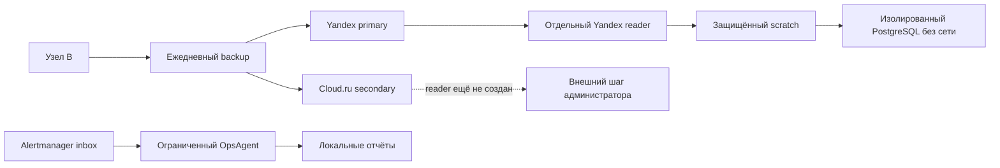

# Узел B: готовность и выполненные исправления 2026-09-09

Узел `dz-ent-01`, профиль `two-vps-split-b`. Первичный аудит выполнен
14:53–14:57 UTC; ниже учтены последующие исправления и проверки того же дня.
Это свидетельства конкретных проверок, а не гарантия будущей работоспособности.
Полное учение на чистом VPS исключено из текущего запуска: отдельного сервера нет.

## Что установлено

| Компонент | Результат |
|---|---|
| Mattermost, OpenProject, BookStack | 19 контейнеров работают: 16 healthy, 3 OpenProject без healthcheck |
| Мониторинг и логи | Firing alerts = 0; scrape targets с up=0 = 0 |
| WireGuard, public/internal Caddy | Установлены; итоговый bootstrap --check = 0 |
| Backup | Coverage: platform, vpn-proxy, mattermost, tracker, wiki, observability |
| OpsAgent, ChatOps, Mattermost MCP | Проверки установки и идентичности проходят |
| Уведомления Alertmanager → Mattermost | Прежнее свидетельство 10:53 UTC: 2 сообщения и 3 обновления; текущие проверки сообщений не отправляли |
| Автоматическое расследование | Таймер включён; ограниченные локальные отчёты, без автоматических исправлений и отправки в чат |
| GitLab и Runner | Намеренно отсутствуют: принадлежат узлу A |
| Корпоративный сайт | В профиле external; локальная установка не требуется |

Новые приложения для обязательного профиля B разворачивать не требуется.
Отсутствие healthcheck у worker/cron/cache OpenProject не равно пользовательской
приёмке этих компонентов. Swap = 0, systemd-oomd активен; OOM kill при проверках нет.

## Что исправлено и чем подтверждено

| Область | Изменение | Свидетельство |
|---|---|---|
| Daily RPO | Номинальный RPO 24 ч; свежесть primary и дампов 26 ч, secondary 29 ч; расписание осталось ежедневным | Граничные тесты, проверки трёх сервисов и live retention; повторное применение не меняет файлы |
| Сеть | Единственный владелец eth0 — systemd-networkd/netplan; networking.service и ifup@eth0.service замаскированы | PID networkd, адрес, маршрут и DNS не изменились; failed units = 0; повторный запуск без изменений; конфигурация и маски восстановлены из offsite |
| Mattermost | Короткая остановка приложения, pg_dump и четыре дерева в одном приватном архиве; запуск через независимый systemd supervisor | Два успешных захвата, один через полный backup; восстановление архива dedicated Yandex reader и загрузка БД в изолированный PostgreSQL |
| OpsAgent | Отдельный timer, 17 разрешённых имён алертов, одна ограниченная попытка на событие | Реальная модель gpt-6-astra/medium обработала синтетический тест; повторное событие не вызвало модель; штатный oneshot и повторная установка успешны |
| Cloud.ru reader | Подготовлен код создания отдельных runtime/sops/attestation файлов со скрытым вводом ключа | Код и тесты готовы; внешняя учётная запись пока отсутствует, live secondary reader не настроен |

24 ч — номинальный интервал, а не строгая гарантия потери не более 24 ч:
таймер имеет jitter, копирование занимает время, возможен пропуск цикла.
Порог свежести не меняет фактическую частоту копирования.

## Архитектура и поток проверки

Подробные high-level, low-level и flow схемы находятся в инструкциях
[Mattermost](https://github.com/djd1m/corp-infra-ent-infra/blob/main/for-humans/09-mattermost.md),
[расследователя](https://github.com/djd1m/corp-infra-pop-agents/blob/main/for-humans/11-alert-investigation.md)
и [Cloud.ru reader](https://github.com/djd1m/corp-infra-backup/blob/main/for-humans/08-cloudru-reader.md).

## Границы доказанного восстановления

Архив Mattermost восстановлен из primary с `--no-lock --no-cache --verify`.
В процессе закрыт доступ к writer-профилям, local.env и приватному age-ключу;
использован готовый root-private ro.env. SHA256 совпал с исходным архивом.
Это проверяет независимость reader от writer на текущем узле, но не заменяет
получение аварийного комплекта вне исходного VPS.

Временный PostgreSQL 16.9 имел network=none, без портов, MemoryMax 384 MiB,
corp-backup.slice. `pg_restore --exit-on-error` успешен: users=7, teams=1,
channels=9, posts=28, fileinfo=0. Временный контейнер удалён. Вложений в БД нет,
поэтому их пользовательский round-trip пока не доказан. Production БД не заменялась.
Два захвата кратко останавливали только приложение Mattermost; идентификаторы
всех 19 контейнеров сохранены, остальные 18 не перезапускались.

## Что остаётся

1. Администратору создать отдельный Cloud.ru reader с List/Get только нужного
   bucket, без inherited write/admin/ACL grants, затем выполнить скрытый ввод
   через `configure-operator-readonly.sh --target secondary --yes` после `--check`.
   Writer-ключ не заменяет reader. Проверку чтения и восстановления из secondary
   завершать только после появления этой учётной записи.
2. Подтвердить доступность внешнего escrow и аварийных материалов независимо
   от исходного узла. Полное восстановление и фактический RTO на чистом VPS
   отложены до появления сервера; успех не заявлен.
3. Проверить пользовательские операции и контрольное вложение Mattermost,
   а также недостающие service drills wiki/observability в следующем цикле приёмки.
4. Проверка сетевой конфигурации после перезагрузки требует доступной консоли.
   В этом запуске не выполнялись reboot, ifdown, netplan apply или stop сети.

Общие last-snapshot/last-offsite и coverage не заменяют возраст snapshot каждого
сервиса. `drills_fresh` принимает последнюю успешную запись журнала в целом и
не доказывает учение для каждого сервиса. Автоматический отчёт OpsAgent —
первичная диагностика по ps/disk/memory, а не доказанная причина или исправление.
Проверка установки таймера не заменяет чтение статуса попыток в SQLite.
