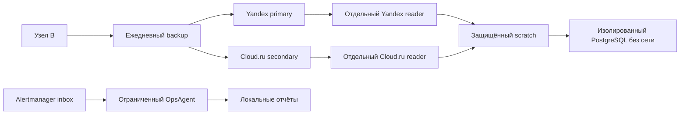

# Узел B: готовность и выполненные исправления 2026-09-09

Узел `dz-ent-01`, профиль `two-vps-split-b`. Первичный аудит выполнен
14:53–14:57 UTC; ниже учтены последующие исправления и проверки того же дня.
Это свидетельства конкретных проверок, а не гарантия будущей работоспособности.
Полное учение на чистом VPS исключено из текущего запуска: отдельного сервера нет.

## Что установлено

| Компонент | Результат |
|---|---|
| Mattermost, OpenProject, BookStack | 19 контейнеров работают: 16 healthy, 3 OpenProject без healthcheck |
| Мониторинг и логи | Firing alerts = 0; scrape targets с up=0 = 0 |
| WireGuard, public/internal Caddy | Установлены; итоговый bootstrap --check = 0 |
| Backup | Coverage: platform, vpn-proxy, mattermost, tracker, wiki, observability |
| OpsAgent, ChatOps, Mattermost MCP | Проверки установки и идентичности проходят |
| Уведомления Alertmanager → Mattermost | Прежнее свидетельство 10:53 UTC: 2 сообщения и 3 обновления; в цикле восстановления отправлено одно согласованное контрольное сообщение с вложением |
| Автоматическое расследование | Таймер включён; ограниченные локальные отчёты, без автоматических исправлений и отправки в чат |
| GitLab и Runner | Намеренно отсутствуют: принадлежат узлу A |
| Корпоративный сайт | В профиле external; локальная установка не требуется |

Новые приложения для обязательного профиля B разворачивать не требуется.
Отсутствие healthcheck у worker/cron/cache OpenProject не равно пользовательской
приёмке этих компонентов. Swap = 0, systemd-oomd активен; OOM kill при проверках нет.

## Что исправлено и чем подтверждено

| Область | Изменение | Свидетельство |
|---|---|---|
| Daily RPO | Номинальный RPO 24 ч; свежесть primary и дампов 26 ч, secondary 29 ч; расписание осталось ежедневным | Граничные тесты, проверки трёх сервисов и live retention; повторное применение не меняет файлы |
| Сеть | Единственный владелец eth0 — systemd-networkd/netplan; networking.service и ifup@eth0.service замаскированы | PID networkd, адрес, маршрут и DNS не изменились; failed units = 0; повторный запуск без изменений; конфигурация и маски восстановлены из offsite |
| Mattermost | Короткая остановка приложения, pg_dump и четыре дерева в одном приватном архиве; запуск через независимый systemd supervisor | Два успешных захвата, один через полный backup; восстановление архива dedicated Yandex reader и загрузка БД в изолированный PostgreSQL |
| OpsAgent | Отдельный timer, 17 разрешённых имён алертов, одна ограниченная попытка на событие | Реальная модель gpt-6-astra/medium обработала синтетический тест; повторное событие не вызвало модель; штатный oneshot и повторная установка успешны |
| Cloud.ru reader | Администратор настроил отдельную учётную запись; IAM administrator-attested | 23 snapshot доступны; архив Mattermost восстановлен при закрытом доступе к writer-профилям, SHA256 и проверка структуры успешны; повторная настройка без изменений |

24 ч — номинальный интервал, а не строгая гарантия потери не более 24 ч:
таймер имеет jitter, копирование занимает время, возможен пропуск цикла.
Порог свежести не меняет фактическую частоту копирования.

## Архитектура и поток проверки

Подробные high-level, low-level и flow схемы находятся в инструкциях
[Mattermost](https://github.com/djd1m/corp-infra-ent-infra/blob/main/for-humans/09-mattermost.md),
[расследователя](https://github.com/djd1m/corp-infra-pop-agents/blob/main/for-humans/11-alert-investigation.md)
и [Cloud.ru reader](https://github.com/djd1m/corp-infra-backup/blob/main/for-humans/08-cloudru-reader.md).

## Границы доказанного восстановления

Архив Mattermost восстановлен из primary с `--no-lock --no-cache --verify`.
В процессе закрыт доступ к writer-профилям, local.env и приватному age-ключу;
использован готовый root-private ro.env. SHA256 совпал с исходным архивом.
Это проверяет независимость reader от writer на текущем узле, но не заменяет
получение аварийного комплекта вне исходного VPS.

Контрольное вложение Mattermost загружено и скачано через API, затем выполнен
новый согласованный backup. Snapshot `534f57df` восстановлен отдельным Yandex
reader; изолированный PostgreSQL подтвердил связь FileInfo с Post и наличие ID
вложения в Post.FileIds. SHA256 файла из восстановленного data совпал с receipt.
Проверка повторена успешно; временные контейнеры удалены. Production БД не
заменялась. Все 19 идентификаторов контейнеров сохранены; только приложение
Mattermost кратко останавливалось для согласованного захвата.

Cloud.ru reader дополнительно проверен 2026-09-09 после его создания:
тот же архив 362772480 байт восстановлен за 2 мин 37 с. Writer-профили обоих
облаков, Yandex ro.env, local.env и приватный age-каталог были недоступны.
SHA256 и проверка формата успешны. Это закрывает проверку отдельного reader
для обоих облаков на живом узле; внешнее получение аварийного комплекта
остаётся самостоятельной задачей.

## Изолированные проверки и свежесть: завершающий цикл

BookStack snapshot 03903c30 восстановлен dedicated reader: импорт в отдельную
MariaDB и CHECK TABLE семи таблиц успешны дважды. Users=2, entities/images/attachments=0;
проверено дерево из 332 файлов конфигурации. Пользовательские страницы в копии отсутствуют.
Grafana теперь сохраняется через согласованный SQLite snapshot в root-private dumps:
копия ea14736f прошла integrity/FK и запуск отдельной Grafana с database=ok дважды.
Prometheus config/rules и disabled template Alertmanager проверены штатными утилитами.
История метрик/логов и пользовательский вход не входят в эти свидетельства.

Свежесть всех 18 пар подтверждена, три repository probe успешны. Новые systemd
service/timer включены в platform backup и восстановлены из offsite с точным
совпадением байтов и прав. Secondary sync завершился успешно. Bootstrap --check=0;
19 контейнеров работают, 16 healthy; firing alerts=0, down targets=0, OOM kill=0.

Инструкции со схемами:
[проверки восстановления](https://github.com/djd1m/corp-infra-ent-infra/blob/main/for-humans/10-isolated-restore-verification.md),
[свежесть сервисов](https://github.com/djd1m/corp-infra-backup/blob/main/for-humans/09-service-freshness.md).

## Что остаётся

1. Подтвердить доступность внешнего escrow и аварийных материалов независимо
   от исходного узла. Полное восстановление и фактический RTO на чистом VPS
   отложены до появления сервера; успех не заявлен.
2. Проверить пользовательские сценарии входа и работы приложений после
   восстановления; изолированные проверки не заменяют такую приёмку.
3. Проверка сетевой конфигурации после перезагрузки требует доступной консоли.
   В этом запуске не выполнялись reboot, ifdown, netplan apply или stop сети.

Возраст snapshot теперь проверяется отдельно для 6 сервисов в 3 репозиториях:
18 ожидаемых пар, пороги 26 ч local/primary и 29 ч secondary. Почасовой inventory
проверяет репозитории; отсутствие, устаревание и ошибки capture/probe имеют
отдельные алерты. Новые имена алертов пока не включены в allowlist
автоматического расследователя OpsAgent; штатная маршрутизация Alertmanager
сохранена. `drills_fresh` принимает последнюю успешную запись журнала в целом и
не доказывает учение для каждого сервиса. Автоматический отчёт OpsAgent —
первичная диагностика по ps/disk/memory, а не доказанная причина или исправление.
Проверка установки таймера не заменяет чтение статуса попыток в SQLite.
